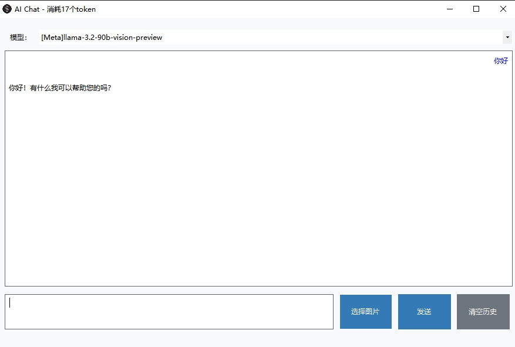

# AIChat

## 0.示例图



## 1.项目运行

```bash
dotnet run
```

## 2.项目打包

```bash
dotnet publish
```

## 3.打包的exe优化成单文件并压缩

先跳转到publish目录

```bash
cd .\bin\Debug\net20\win-x64\publish
```

```bash
ilrepack /out:AIChat.exe AIChatApp.exe Newtonsoft.Json.dll System.Xml.Linq.dll
```

## 4.如果没有ilrepack命令需要安装

```bash
dotnet tool install -g dotnet-ilrepack
```

## 5.powershell设置临时代理

```bash
$env:HTTP_PROXY = "http://127.0.0.1:15733"
$env:HTTPS_PROXY = "http://127.0.0.1:15733"
```
